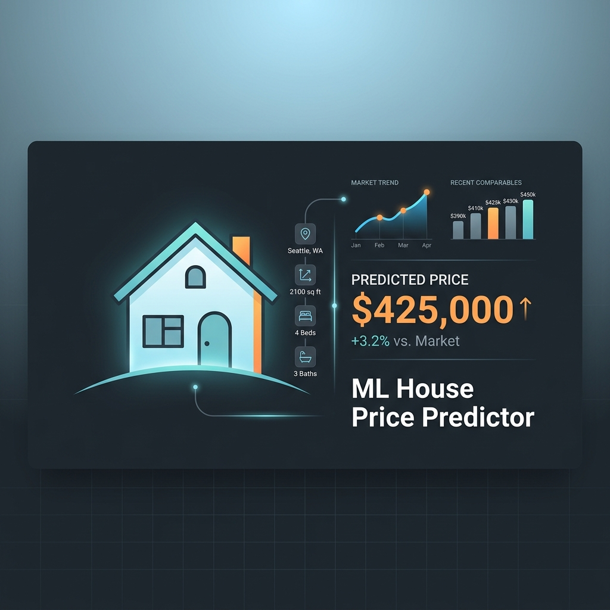

<div align="center">
  

  # 🏠 Machine Learning House Price Predictor
  
  *A beginner-friendly AI project that predicts real estate prices using Random Forest Regression.*
</div>

---

## 🌟 About the Project

This project is designed to be an easily explainable, end-to-end Machine Learning application. It uses the classic **California Housing Dataset** to predict the median house value in a given block group based on various demographic and structural features.

It's perfect for beginners learning AI/ML because it demonstrates:
1. **Data Handling:** Loading and preparing data using `pandas`.
2. **Machine Learning Training:** Training a **Random Forest Regressor** using `scikit-learn`.
3. **Model Evaluation:** Understanding metrics like Mean Squared Error (MSE) and R-squared ($R^2$).
4. **Web UI Deployment:** Creating a sleek, interactive web interface using `Streamlit`.

## 🛠️ Setup Instructions

### 1. Clone the repository
```bash
git clone https://github.com/KunjuBot/house_price_predictor.git
cd house_price_predictor
```

### 2. Create a virtual environment (Recommended)
```bash
python -m venv .venv

# On Windows:
.\.venv\Scripts\activate

# On Mac/Linux:
source .venv/bin/activate
```

### 3. Install dependencies
```bash
pip install pandas scikit-learn matplotlib seaborn streamlit joblib
```

## 🚀 How to Run

### Step 1: Train the Model (Optional)
I have included a pre-trained model (`house_model.pkl`), but you can train your own! Run the training script to build the AI model from scratch.
```bash
python train.py
```
*This will output the MSE and R-squared metrics to your terminal and save the new model.*

### Step 2: Start the Web App
Launch the interactive Streamlit interface.
```bash
streamlit run app.py
```
This will open a browser window at `http://localhost:8501`. Adjust the sliders to see how factors like income, house age, and location affect the predicted price!

## 📁 Repository Structure
* `train.py`: The Python script that loads data, trains the Random Forest model, and saves it.
* `app.py`: The Streamlit web application code that provides the UI.
* `house_model.pkl`: The saved, pre-trained Machine Learning model.
* `model_features.pkl`: Saved feature names to ensure the app matches the training data.

---
*Built as a simple, explainable AI project for beginners.*
